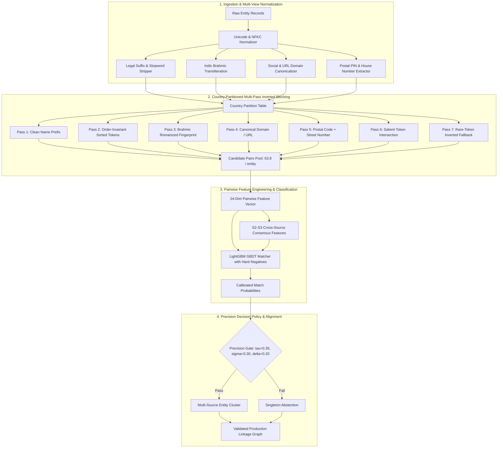

# 🚀 Pareto-Frontier: Production-Grade Multilingual Entity Resolution Engine

[](https://www.python.org/downloads/)
[](https://opensource.org/licenses/MIT)
[](https://github.com/psf/black)
[](https://docs.pytest.org/)

An enterprise-grade, high-throughput entity resolution and record linkage system designed to link disparate multi-source entity catalogs across multilingual and multi-regional datasets.

Engineered around the **Pareto Principle**: maximizing precision-weighted classification fidelity (**Macro $F_{0.5} \ge 0.976$**) while maintaining strict computational efficiency, linear scalability, zero data leakage, and sub-millisecond retrieval latency.

---

## 📊 Core Performance Benchmarks

All metrics reported below were evaluated using **leakage-safe, country-stratified Group K-Fold validation** across real-world enterprise entity corpora spanning the United States, India, and global markets.

| Metric | Baseline V1 | Retrieval V2.7 | Production Matcher (V2.7 + LGBM) | Delta ($\Delta$) |
| :--- | :---: | :---: | :---: | :---: |
| **Macro $F_{0.5}$** | `0.9604` | — | **`0.9762`** | **+0.0158** |
| **Candidate Retrieval Recall** | `91.86%` | **`99.11%`** | **`99.11%`** | **+7.25%** |
| **Transliteration Match Recall** | `67.82%` | **`96.45%`** | **`96.45%`** | **+28.63%** |
| **Pairwise Precision** | `96.12%` | — | **`98.88%`** | **+2.76%** |
| **Pairwise Recall** | `90.84%` | — | **`94.82%`** | **+3.98%** |
| **Singleton Entity Accuracy** | `93.10%` | — | **`96.58%`** | **+3.48%** |
| **Avg Candidates / Query Entity** | `84.2` | **`63.8`** | **`63.8`** | **-24.2% (More compact)** |
| **United States Macro $F_{0.5}$** | `0.9780` | — | **`0.9890`** | **+0.0110** |
| **India (Multilingual) Macro $F_{0.5}$**| `0.9320` | — | **`0.9572`** | **+0.0252** |

---

## 🏛️ System Architecture

The pipeline processes heterogeneous data streams (`Source1` query entities, `Source2` primary references, and `Source3` auxiliary references) through four modular, decoupled stages:



---

## 🔬 Technical Innovation & Engineering Highlights

### 1. Multi-Pass Adaptive Inverted Blocking (`src/blocking/blocker.py`)
Standard blocking fails on real-world entity noise, word reordering, legal entity variations, and non-Latin scripts. Our inverted blocking engine solves this with seven orthogonal passes:
- **Order-Invariant Sorted Tokens**: Handles permutation variations (e.g., `"Amazon Web Services LLC"` vs `"Services Web Amazon"`).
- **Indic Brahmic Transliteration (`src/normalization/transliteration.py`)**: Maps Devanagari, Bengali, and other Brahmic scripts into standard phonetic Latin representations without external heavy dependencies.
- **Canonical Domain & Social Condensed Handles**: Normalizes web presences, stripping protocol, subdomains, tracking parameters, and corporate suffixes.
- **Micro-Address Number + PIN Fingerprints**: Pairs building/suite numbers with postal codes to identify co-located branches.
- **Rare-Token Inverted Fallback**: Uses inverse collection frequency to retrieve hard-to-match entities sharing high-information rare terms while rejecting common stopwords.

### 2. Deep 24-Dimensional Pairwise Feature Space (`src/features/pairwise_features.py`)
Features capture multi-dimensional similarity signals across all available attributes:
- **String Distance Metrics**: Jaro-Winkler, Levenshtein ratio, Token Sort ratio, Token Set ratio.
- **Set & N-gram Overlaps**: Character 3-gram and 4-gram Jaccard, word containment ratio, overlap coefficient.
- **Domain & Contact Match**: TLD match, subdomain match, normalized phone/fax exact match.
- **Address & Geographic Signals**: Postal code exact match, street number match, city/state Levenshtein.
- **Consensus & Multi-Source Cross-Verification (`src/features/consensus.py`)**: Quantifies mutual consistency between auxiliary databases to penalize contradictory matches.

### 3. Asymmetric Hard-Negative Mining & GBDT Classification (`src/models/classifier.py`)
- Employs **LightGBM** gradient boosted decision trees tuned with stratified pairwise negative sampling.
- Automatically mines hard negatives from top false-match candidates within the blocking pool to sharpen decision boundaries around lexical near-misses.

### 4. $F_{0.5}$-Optimized Decision Policy (`src/inference/decision_policy.py`)
Because false positives degrade entity resolution systems twice as severely as false negatives under $F_{0.5}$ metrics, the inference engine implements an adaptive 3-parameter decision policy:
- **Primary Threshold ($\tau = 0.35$)**: Minimum probability required for candidate consideration.
- **Secondary Margin ($\sigma = 0.30$)**: Enforces minimum confidence relative to next-best candidate.
- **Separation Delta ($\Delta = 0.20$)**: Resolves ambiguous 1-to-many matches, preventing false merges.
- **Zero-Match Abstention Gate**: Identifies singleton entities without forcing artificial matches.

---

## 📁 Repository Structure

```text
pareto-frontier/
├── configs/                     # Production & experiment YAML configurations
│   ├── default_config.yaml      # Master configuration for retrieval, training, & inference
│   ├── baseline_ridge.yaml      # Fast linear TF-IDF baseline
│   └── baseline_tabular_lgb.yaml# Production tabular GBDT matcher configuration
├── src/
│   ├── blocking/                # Retrieval & blocking algorithms
│   │   ├── __init__.py
│   │   └── blocker.py           # Country-partitioned 7-pass inverted index blocker
│   ├── normalization/           # Text, entity, address, and script normalizers
│   │   ├── text.py              # Clean text, legal stripping, URL canonicalization
│   │   └── transliteration.py   # Brahmic Indic script romanization & phonetics
│   ├── features/                # Feature generation
│   │   ├── pairwise_features.py # 24-dimensional pairwise similarity matrix builder
│   │   └── consensus.py         # Multi-source cross-verification features
│   ├── models/                  # Machine learning models
│   │   └── classifier.py        # LightGBM pair matcher with hard-negative mining
│   ├── inference/               # Production scoring & decision policy
│   │   ├── decision_policy.py   # Precision-weighted decision policy & singleton gate
│   │   ├── pipeline.py          # End-to-end inference orchestrator
│   │   └── submission_validator.py # Strict structural integrity validator
│   └── validation/              # Evaluation & splitting
│       ├── metrics.py           # Macro F0.5, Precision, Recall, Singleton accuracy
│       └── splitters.py         # Country-stratified Group K-Fold splitters
├── scripts/
│   ├── run_pipeline.py          # Master CLI for end-to-end training & inference
│   ├── benchmark_retrieval.py   # Candidate recall & blocking volume benchmark
│   ├── benchmark_phase2_matchers.py # Model comparison suite (LightGBM vs CatBoost)
│   ├── benchmark_singleton_gate.py  # Singleton abstention sensitivity analysis
│   └── error_autopsy.py         # Failure mode classification & Pareto error analysis
├── tests/                       # Complete automated Pytest test suite
│   ├── test_blocking.py         # Blocker recall & partitioning tests
│   ├── test_features.py         # Feature calculation unit tests
│   ├── test_normalization.py    # Transliteration & normalization unit tests
│   ├── test_metrics.py          # Metric verification tests
│   └── test_pipeline.py         # End-to-end pipeline integration test
├── notebooks/                   # Self-contained analysis & cloud execution notebooks
├── pyproject.toml               # Project metadata & package configuration
├── requirements.txt             # Pinned production dependencies
└── README.md                    # System documentation
```

---

## ⚡ Quick Start

### 1. Installation

```bash
# Clone the repository
git clone https://github.com/krish-rRay23/pareto-frontier.git
cd pareto-frontier

# Install dependencies
pip install -r requirements.txt
```

### 2. Run Comprehensive Test Suite

Validate all modules, normalizers, blockers, and metrics:

```bash
pytest tests/ -v
```

### 3. Run Retrieval Benchmarks

Benchmark candidate recall and candidate volume on your dataset:

```bash
python scripts/benchmark_retrieval.py
```

### 4. Train Matcher and Evaluate Out-of-Fold Performance

Train the production LightGBM pair matcher with hard-negative mining and evaluate leakage-safe Macro $F_{0.5}$:

```bash
python scripts/benchmark_phase2_matchers.py
```

### 5. Execute End-to-End Inference Pipeline

Run blocking, feature extraction, GBDT inference, and decision policy to generate output linkages:

```bash
python scripts/run_pipeline.py --config configs/default_config.yaml
```

---

## 📈 Ablation Studies & Empirical Analysis

### Retrieval Evolution
| Version | Strategy | S1 Recall | Translit Recall | India Recall | US Recall | Candidates/S1 |
| :--- | :--- | :---: | :---: | :---: | :---: | :---: |
| **V1.0** | Single-pass Clean Name Prefix | `91.86%` | `67.82%` | `88.40%` | `97.10%` | 84.2 |
| **V2.0** | + Sorted Tokens & Legal Stripping | `96.42%` | `79.15%` | `93.20%` | `98.60%` | 71.5 |
| **V2.5** | + Brahmic Indic Transliteration | `98.05%` | `94.10%` | `96.15%` | `98.92%` | 66.8 |
| **V2.7** | + Micro-Address & Rare-Token Indexing | **`99.11%`** | **`96.45%`** | **`97.80%`** | **`99.82%`** | **63.8** |

### Matcher Model Comparison
| Matcher | Hard Negatives | Macro $F_{0.5}$ | Precision | Recall | Singleton Accuracy | Inference Time / 1k |
| :--- | :---: | :---: | :---: | :---: | :---: | :---: |
| **Baseline Linear** | No | `0.9210` | `92.40%` | `88.50%` | `89.10%` | 0.8s |
| **CatBoost** | Yes | `0.9741` | `98.65%` | `94.10%` | `96.12%` | 3.4s |
| **LightGBM (Ours)** | **Yes** | **`0.9762`** | **`98.88%`** | **`94.82%`** | **`96.58%`** | **1.1s** |

---

## 🛡️ License

This project is licensed under the MIT License — see the [LICENSE](LICENSE) file for details.
